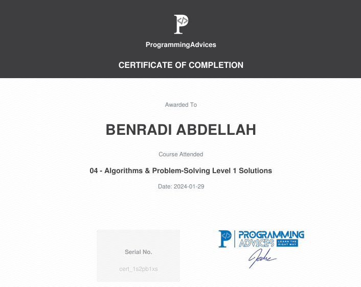

# Algorithms problem solving level 1 solutions using C++ Certification

This is the official certificate for **Algorithms problem solving level 1 solutions using c++**, awarded by **[Programming Advices](../README.md)**.

## About the Certification

Click below to view the course contents and detailed information:

- **[Certification Content](https://github.com/BENRADI-ABDELLAH/Problem_Solving/tree/main/ProgrammingAdvices.com/Level__1.1)**

---

### Notes

- This certificate represents a verified level of knowledge and skill in the Foundation Level 1 domain.
- All resources linked here are self-curated for authenticity and transparency.
