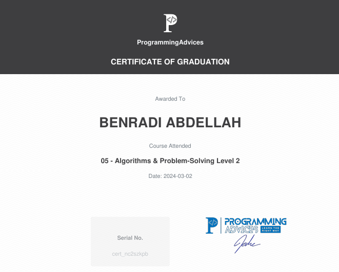

# Algorithms problem solving level 2 Certification

This is the official certificate for **Algorithms problem solving level 2**, awarded by **[Programming Advices](../README.md)**.

## About the Certification

Click below to view the course contents and detailed information:

## Certification Content
- **[Problem Solving](https://github.com/BENRADI-ABDELLAH/Problem_Solving/tree/main/ProgrammingAdvices.com/Level__2)**
- **[Project 1: Stone - Paper - Scissor](https://github.com/BENRADI-ABDELLAH/Projects/tree/main/Stone_Paper_Scissor)
- **[Project 2: Math Game](https://github.com/BENRADI-ABDELLAH/Projects/tree/main/Math_Game)
---

### Notes

- This certificate represents a verified level of knowledge and skill in the Foundation Level 1 domain.
- All resources linked here are self-curated for authenticity and transparency.
