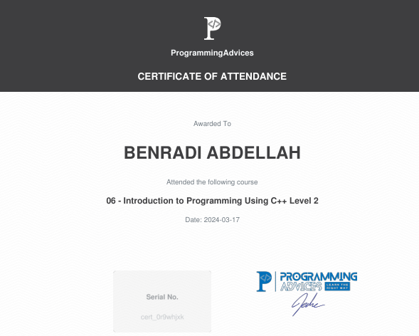

# Introduction to programming using C++ LEVEL 2 Certification

This is the official certificate for **Introduction to programming using C++ LEVEL 2**, awarded by **[Programming Advices](../README.md)**.

## About the Certification

Click below to view the course contents and detailed information:

- Certification Content: ici sera le contenu de ce certificat

---

### Notes

- This certificate represents a verified level of knowledge and skill in the Foundation Level 1 domain.
- All resources linked here are self-curated for authenticity and transparency.
