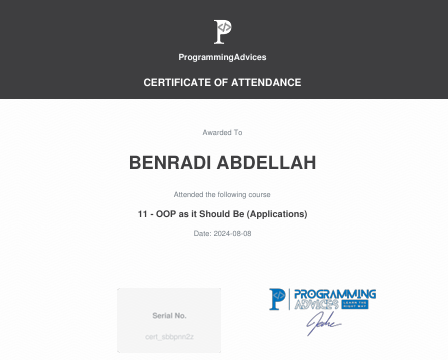

# Oop as it should be applications

 awarded by **[Programming Advices](../README.md)**.

### Certification Content
- **ICI je metterai le contenu du cours*
---

### Notes

- This certificate represents a verified level of knowledge and skill in the Foundation Level 1 domain.
- All resources linked here are self-curated for authenticity and transparency.
