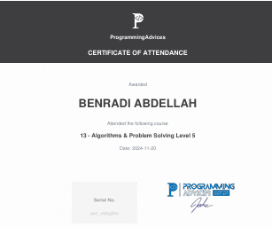

# Algorithms problem solving level 5 Certification

This is the official certificate for **Algorithms problem solving level 5**, awarded by **[Programming Advices](../README.md)**.

### Certification Content
- **[Problem Solving](https://github.com/BENRADI-ABDELLAH/Problem_Solving/tree/main/ProgrammingAdvices.com/Level__5)**
- **[Project](#)**
---

### Notes

- This certificate represents a verified level of knowledge and skill in the Foundation Level 1 domain.
- All resources linked here are self-curated for authenticity and transparency.
