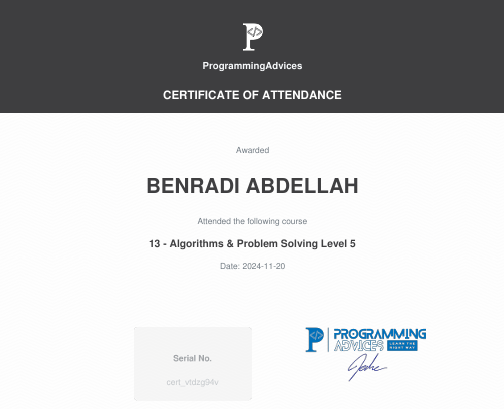

# Dernier Certificat Obtenu Chez Programming Advices
### Algorithms And Problem Solving LEVEL 5

This is the official certificate for **Algorithms problem solving level 5**, awarded by **[Programming Advices](../README.md)**.

### Certification Content
- **[Problem Solving](https://github.com/BENRADI-ABDELLAH/Problem_Solving/tree/main/ProgrammingAdvices.com/Level__5)**
- **[Project](#)**
---

# Historique De Certifications 

| Organisme                                                 | Platforme                                                 | Objectif de la Formation                                  |  
|-----------------------------------------------------------|-----------------------------------------------------------|-----------------------------------------------------------|  
| | [En savoir plus sur l'organisme](./README.md)             | Fondamentaux de La Programmation                          |   
|                                                           |                                                           |  Developpement Back End                                   | 
|                                                           |                                                           |  Developpement Full Stack                                 |  

## Tableau des Certifications

 N | Date d'obtention   | Certification                             | Language   | Level | Lien vers le certificat      |  
---|--------------------|-------------------------------------------|------------|-------|------------------------------|  
13 | *2024-11-20*       | Algorithms and Problem Solving            | C++        | 5     |[Voir](lien_vers_certificat)  |  
12 | *2024-09-02*       | Data Strucute  - LEVEL 1                  | C++        | 1     | [Voir](lien_vers_certificat) |  
11 | *2024-08-08*       | Oop as it should be applications          | C++        | -     | [Voir](lien_vers_certificat) |  
10 | *2024-07-01*       | Oop as it should be concepts              | C++        | -     | [Voir](lien_vers_certificat) |  
09 | *2024-08-14*       | Fundations LEVEL 2                        | -          | -     | [Voir](lien_vers_certificat) |  
08 | *2024-04-20*       | Algorithms and Problem Solving            | C++        | 4     | [Voir](lien_vers_certificat) |  
07 | *2024-03-29*       | Algorithms and Problem Solving            | C++        | 3     | [Voir](lien_vers_certificat) |  
06 | *2024-03-17*       | Introduction to Programming               | C++        | 2     | [Voir](lien_vers_certificat) |  
05 | *2024-03-02*       | Algorithms and Problem Solving            | C++        | 2     | [Voir](lien_vers_certificat) |  
04 | *2024-01-29*       | Algorithms and Problem Solving            | C++        | 1     | [Voir](lien_vers_certificat) |  
03 | *2024-01-22*       | Introduction to Programming               | C++        | 1     | [Voir](lien_vers_certificat) |  
02 | *2024-01-06*       | Algorithms and Problem Solv               | Flow Chart | 1     | [Voir](lien_vers_certificat) |  
01 | *2024-01-12*       | Fundations LEVEL 1                        | -          | 1     | [Voir](lien_vers_certificat) |  

